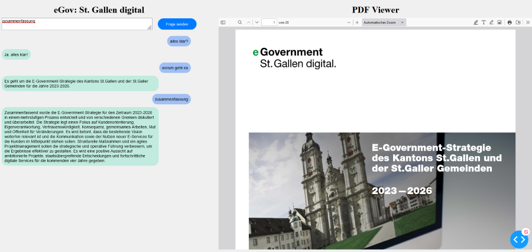

## Query eGovSG

### App

Diese App nutzt Llamaindex und das "Open-Source-Framework" Dash für die Implementierung eines RAG-unterstützten Chatbots zur Befragung des eingebetteten PDFs.

---

### Dash

> [Dash](https://plot.ly/products/dash/) is a productive Python framework for building web applications.
Written on top of Flask, Plotly.js, and React.js, Dash is ideal for building data visualization apps with highly custom user interfaces in pure Python. It's particularly suited for anyone who works with data in Python.

---

### Quelle Dokument: "https://egovsg.ch/wp-content/uploads/2023/01/E-Government-Strategie-des-Kantons-St.Gallen-und-der-St.Galler-Gemeinden-2023-2026.pdf"
[Dokument](https://egovsg.ch/wp-content/uploads/2023/01/E-Government-Strategie-des-Kantons-St.Gallen-und-der-St.Galler-Gemeinden-2023-2026.pdf)

